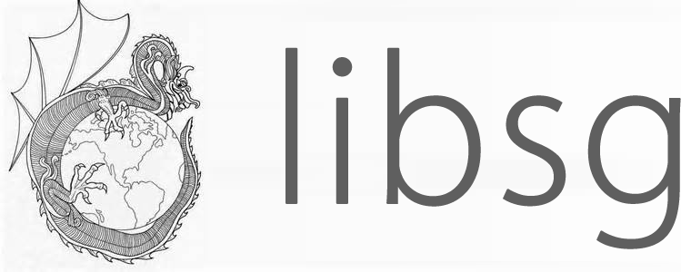

# 

## Overview

Cross-platform C utility library focusing on efficient development and easy-to-use.

## Idea

Reuse, not rework or reinvent.

Using C to build important infrastructure, not everything.

## Feature

#### Efficient development

Common C API vs libsg API sample.

#### Easy-to-install source code

Official pre-built binaries don't have any dependency, you don't need to build or install dependency for libsg.

#### Easy-to-understand APIs

Header files of libsg include nothing but only pure API declaration, and APIs will not cause misunderstanding.

Common C API vs libsg API sample

#### Performance

Key modules are optimized, you can create high performance application with libsg.

## Supported Platforms

Linux ／ Windows ／ OS X

## Download

https://github.com/metalwood/libsg/archive/master.zip

## Build & install

Before building, make sure CMake and C compiler(gcc/clang/msvc) has been installed correctly.

Linux / MacOS

        $ mkdir build
        $ cd build
        $ cmake ..
        $ make -j4

Windows

        $ md build
        $ cd build
        $ cmake ..
        open .sln with Visual Studio and compile the project

## API doc & demo

coming soon

## Modules

**sys** atom mutex rwlock spin_lock memory module os proc time fs flag shell sleep thread ntp

**str** charset regex sprintf vlstr(variable length string)

**net** tcp/tcp_server udp/udp_server http/http_server websocket ftp

etp/etp_server: a extreme transfer protocol based on KCP / LIBUV(UDP) and FEC, it's fast and reliable.

**db** sqlite ejdb berkeleydb

**container** bip_buf list queue xml msgpack json

**compress** zip gzip

**crypto**

md: message digest algorithm pack including MD2/MD4/MD5/SHA1/SHA224/SHA256/SHA512.

mac: message authentication code algorithm pack including HmacMD5...

sym: symmetric encryption algorithm pack including DES/3DES/AES.

**hash** uuid murmur

**media** capture_v capture_a rtsp player

**math** c_int c_float big_int big_float

**platform** windows/dial...

**util** assert dump log

## Code specification

English: [Linux kernel coding style](https://www.kernel.org/doc/Documentation/CodingStyle)            简体中文: [Linux内核编码风格](http://www.cnblogs.com/baochuan/archive/2013/04/08/3006615.html)

## Contact

email: metalwood@foxmail.com                   QQ group: 556925561

## Contributors
metalwood (metalwood@foxmail.com)

canmor (476010464@qq.com)

vincent (vin@misday.com)
